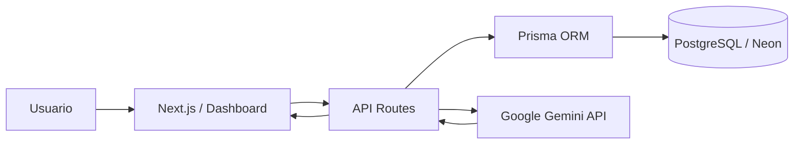

# Plataforma Web Híbrida con Gestión de Datos y Analítica en la Nube

## Grupo 22

Proyecto académico desarrollado como una solución híbrida que integra tecnologías de software libre con servicios propietarios en la nube.

### Integrantes

* Joaquín Edelberto Zelaya Bondanza — Líder del equipo
* Ezequiel Alberto Ramírez Portillo
* Iris Criseida Hernández Rodríguez
* Harold Daniel Miranda Zelaya

**Fecha de presentación:** 16 de agosto de 2026


## 1. Descripción del proyecto

La **Plataforma Web Híbrida con Gestión de Datos y Analítica en la Nube** es una aplicación web diseñada para centralizar el registro, consulta y procesamiento de información mediante una arquitectura moderna.

La solución integra tecnologías de código abierto para el desarrollo de la aplicación y la persistencia de datos, junto con un servicio propietario de Inteligencia Artificial.

El sistema permite:

* Crear registros manuales.
* Consultar registros almacenados.
* Persistir información en una base de datos PostgreSQL.
* Procesar consultas mediante Inteligencia Artificial.
* Visualizar la información desde un dashboard web.
* Mantener separados los componentes de interfaz, backend, persistencia e integración externa.


## 2. Problema que resuelve

El proyecto surge de la necesidad de contar con una plataforma que permita administrar información desde un único entorno y, al mismo tiempo, incorporar capacidades de procesamiento inteligente.

La solución busca evitar que la información y los servicios se encuentren aislados, integrando:

* Interfaz de usuario.
* Lógica del servidor.
* Persistencia de datos.
* Servicios de Inteligencia Artificial.
* Servicios de infraestructura en la nube.

De esta manera se demuestra la interoperabilidad entre tecnologías libres y propietarias dentro de una misma solución.


## 3. Objetivo general

Desarrollar una plataforma web híbrida que permita registrar, consultar y procesar información mediante una arquitectura moderna, integrando software libre, persistencia de datos en la nube y un servicio propietario de Inteligencia Artificial.


## 4. Tecnologías utilizadas

### Frontend y Backend

* **Next.js**
* **React**
* **TypeScript**
* **Tailwind CSS**
* **App Router**
* **Server Components**

Next.js permite integrar la interfaz y las funciones de backend dentro del mismo proyecto.

### Base de datos

* **PostgreSQL**
* **Neon**

Neon proporciona el servicio PostgreSQL alojado en la nube utilizado por la aplicación.

### ORM

* **Prisma ORM**

Prisma facilita la comunicación entre la aplicación y PostgreSQL mediante modelos tipados.

### Inteligencia Artificial

* **Google Gemini**
* **SDK `@google/genai`**

La plataforma incorpora un servicio de Inteligencia Artificial para procesar las consultas enviadas desde el dashboard.

### Control de versiones

* **Git**
* **GitHub**

El equipo utiliza ramas, commits, Pull Requests y procesos de integración para mantener organizado el desarrollo colaborativo.


## 5. Arquitectura de la solución



### Flujo principal

1. El usuario interactúa con el dashboard desarrollado en Next.js.
2. La interfaz envía las solicitudes a las API Routes.
3. Prisma gestiona las operaciones relacionadas con PostgreSQL.
4. Los datos se almacenan en la base de datos alojada en Neon.
5. Cuando una operación requiere procesamiento inteligente, el backend consume el servicio de Google Gemini.
6. El resultado es devuelto a la aplicación para su visualización.


## 6. Estructura principal del proyecto

```text
prisma/
├── migrations/
└── schema.prisma

src/
├── app/
│   ├── api/
│   │   ├── ai/
│   │   └── records/
│   ├── dashboard/
│   ├── layout.tsx
│   └── page.tsx
│
└── lib/
    ├── aiService.ts
    └── prisma.ts

public/
README.md
package.json
prisma.config.ts
```


## 7. Modelo de datos

La aplicación utiliza principalmente las entidades:

### User

Representa al usuario asociado a los registros almacenados.

### Record

Representa la información registrada desde la aplicación.

Entre sus campos principales se encuentran:

* Título.
* Descripción.
* Datos procesados.
* Usuario asociado.
* Fecha de creación.

La relación entre usuarios y registros se gestiona mediante Prisma ORM.


## 8. Configuración del entorno

Para ejecutar el proyecto se necesitan variables de entorno relacionadas con la base de datos y el servicio de Inteligencia Artificial.

Crear un archivo:

```text
.env.local
```

con la siguiente estructura:

```env
DATABASE_URL="CONEXION_POSTGRESQL"
GEMINI_API_KEY="CLAVE_API_GEMINI"
```

> **Importante:** nunca deben colocarse credenciales reales dentro del repositorio público.

Los archivos `.env` deben mantenerse excluidos mediante `.gitignore`.


## 9. Instalación

### 1. Clonar el repositorio

```bash
git clone <URL_DEL_REPOSITORIO>
```

### 2. Ingresar al proyecto

```bash
cd Desarrollo-Colaborativo-de-una-Soluci-n-H-brida-con-Software-Libre-y-Propietario
```

### 3. Instalar dependencias

```bash
npm install
```

En PowerShell también puede utilizarse:

```powershell
npm.cmd install
```

### 4. Generar Prisma Client

```bash
npx prisma generate
```

En PowerShell:

```powershell
npx.cmd prisma generate
```

### 5. Ejecutar el entorno de desarrollo

```bash
npm run dev
```

En PowerShell:

```powershell
npm.cmd run dev
```

### 6. Abrir la aplicación

```text
http://localhost:3000
```


## 10. Funcionalidades principales

### Registro manual

Permite ingresar un título y una descripción para crear información desde el dashboard.

### Consulta de registros

Permite recuperar y visualizar los registros almacenados mediante las rutas de API.

### Asistente Inteligente IA

Permite enviar un prompt para ser procesado mediante Google Gemini.

### Vista de detalle

La aplicación dispone de rutas dinámicas para consultar individualmente la información de un registro.

### Dashboard

Centraliza:

* Registro manual.
* Consultas de Inteligencia Artificial.
* Estado general de la solución.
* Visualización de información almacenada.


## 11. Pruebas finales – Semana 3

Durante la fase de evaluación final se realizaron diferentes verificaciones sobre el entorno de desarrollo.

| Prueba                                       | Resultado                               |
| -------------------------------------------- | --------------------------------------- |
| Inicio del proyecto Next.js                  | Correcto                                |
| Carga de página principal                    | Correcto                                |
| Carga del dashboard                          | Correcto                                |
| Instalación y sincronización de dependencias | Realizada                               |
| Generación de Prisma Client                  | Realizada                               |
| Verificación de integración con PostgreSQL   | Requiere credenciales válidas de Neon   |
| Verificación del módulo de IA                | Requiere `GEMINI_API_KEY` válida        |
| Revisión del flujo de ramas Git              | Correcto                                |
| Revisión de variables sensibles              | Protegidas mediante archivos de entorno |

Las pruebas permitieron identificar la importancia de mantener sincronizadas las dependencias y las variables de configuración utilizadas por cada integrante del equipo.


## 12. Incidencias identificadas durante las pruebas

### Dependencias después de actualizar ramas

Al sincronizar las últimas versiones del proyecto fue necesario actualizar las dependencias locales.

Solución:

```bash
npm install
```

### Generación del cliente Prisma

Después de actualizar las dependencias se verificó la correcta generación del cliente ORM.

Solución:

```bash
npx prisma generate
```

### Variables de entorno

La aplicación depende de credenciales que, por seguridad, no se encuentran almacenadas en GitHub.

Cada desarrollador debe configurar localmente:

```text
DATABASE_URL
GEMINI_API_KEY
```

### PowerShell y ejecución de npm

En determinados equipos Windows, PowerShell puede bloquear la ejecución de `npm.ps1`.

Como alternativa se puede utilizar:

```powershell
npm.cmd run dev
```

Esto permite ejecutar el proyecto sin modificar las políticas generales de seguridad del sistema operativo.


## 13. Consideraciones de seguridad

### Protección de credenciales

Las claves y cadenas de conexión deben mantenerse mediante variables de entorno.

Nunca deben subirse al repositorio:

* Contraseñas.
* API Keys.
* Tokens.
* Cadenas privadas de conexión.

### Validación de información

Los datos provenientes del usuario deben validarse antes de enviarse a la base de datos o a servicios externos.

### Servicios externos

La aplicación debe manejar posibles errores o indisponibilidad de servicios propietarios sin comprometer completamente la operación del sistema.

### Privacidad

Las evidencias utilizadas para documentación o presentación no deben mostrar información confidencial ni credenciales.


## 14. Consideraciones éticas

La integración de Inteligencia Artificial debe utilizarse de forma responsable.

Las respuestas generadas por IA:

* Pueden contener errores.
* No deben considerarse automáticamente como información definitiva.
* Deben ser revisadas cuando sean utilizadas para decisiones importantes.
* No deben utilizar información sensible sin autorización.

También deben respetarse las condiciones de uso de los servicios propietarios y las licencias correspondientes a las tecnologías de código abierto.


## 15. Trabajo colaborativo

El desarrollo se administra mediante Git y GitHub.

El flujo utilizado contempla:

```text
main
  │
develop
  │
  ├── feature/cloud-integration
  ├── feature/iris-semana3-optimizacion
  └── otras ramas de trabajo
```

Cada integrante puede trabajar en una rama independiente y posteriormente integrar sus cambios mediante Pull Requests.

Este flujo permite:

* Mantener trazabilidad de los cambios.
* Evitar modificaciones directas sobre las ramas principales.
* Identificar las contribuciones de cada integrante.
* Revisar los cambios antes de integrarlos.
* Reducir conflictos durante el desarrollo colaborativo.


## 16. Actividades de cierre – Semana 3

Durante la Semana 3 se realizó la revisión final de la solución y de su documentación.

Entre las actividades desarrolladas se encuentran:

* Sincronización de las ramas del repositorio.
* Verificación del entorno local.
* Actualización de dependencias.
* Ejecución de pruebas sobre la página principal y el dashboard.
* Revisión de Prisma y de la configuración necesaria para la persistencia.
* Verificación del manejo seguro de variables de entorno.
* Documentación de incidencias encontradas durante las pruebas.
* Ampliación de la documentación técnica del repositorio.
* Preparación de evidencias para la presentación final.
* Organización de la información requerida para el video de exposición.


## 17. Aprendizajes obtenidos

El desarrollo permitió fortalecer conocimientos relacionados con:

* Desarrollo web con Next.js.
* Programación con TypeScript.
* Arquitecturas híbridas.
* Integración de APIs.
* Uso de Inteligencia Artificial.
* Persistencia con PostgreSQL.
* Uso de Prisma ORM.
* Variables de entorno.
* Control de versiones con Git.
* Trabajo colaborativo mediante GitHub.
* Manejo de ramas y Pull Requests.
* Diagnóstico de errores de configuración.
* Seguridad de credenciales.

Uno de los principales aprendizajes fue comprender que una aplicación no depende únicamente del código fuente, sino también de la correcta configuración del entorno, dependencias, servicios externos y credenciales requeridas para cada integración.


## 18. Estado del proyecto

La plataforma dispone de una arquitectura preparada para integrar:

* Frontend.
* Backend.
* Base de datos PostgreSQL.
* ORM.
* Servicios de Inteligencia Artificial.
* Servicios externos en la nube.

La solución constituye una demostración práctica de interoperabilidad entre tecnologías de código abierto y servicios propietarios dentro de una arquitectura web moderna.


## Proyecto académico

**Plataforma Web Híbrida con Gestión de Datos y Analítica en la Nube**

**Grupo 22 — 2026**
